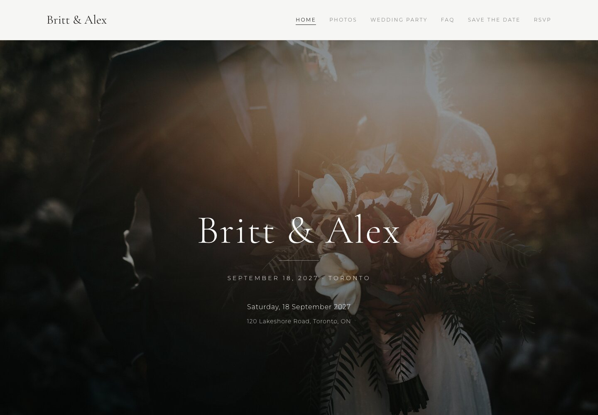
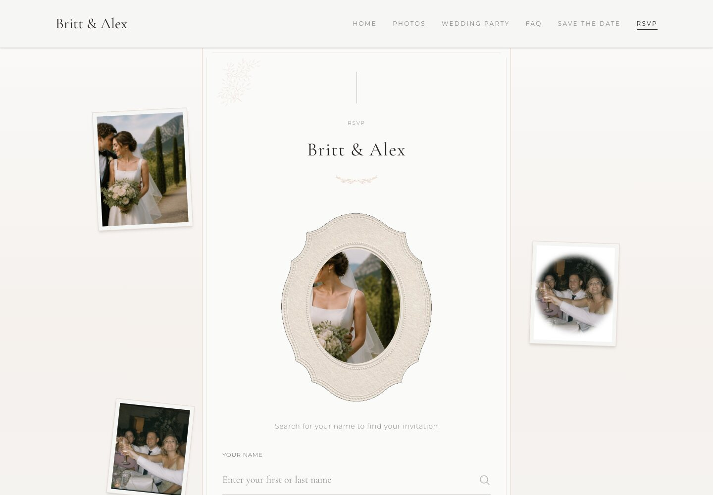
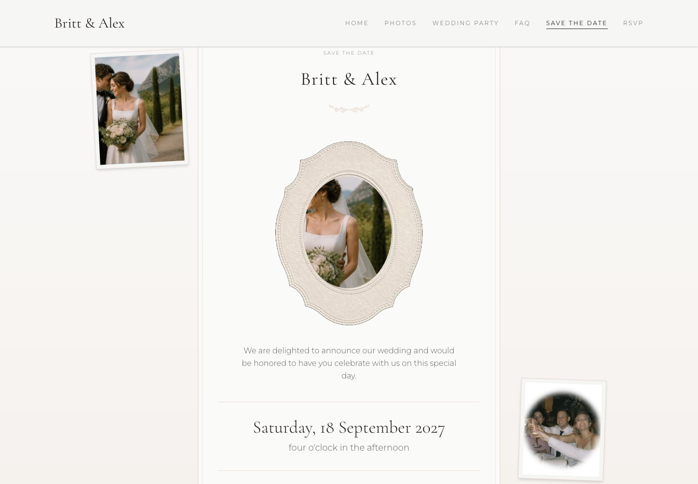
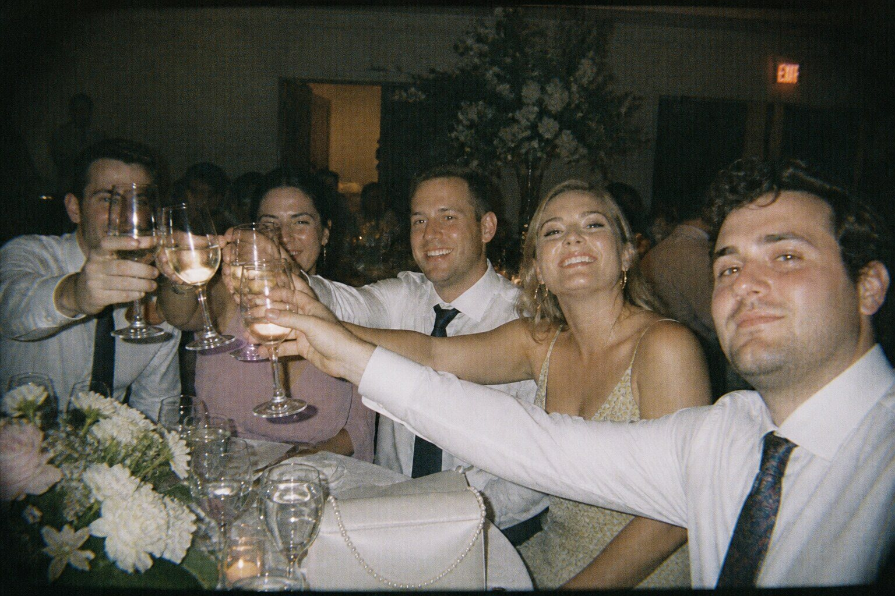
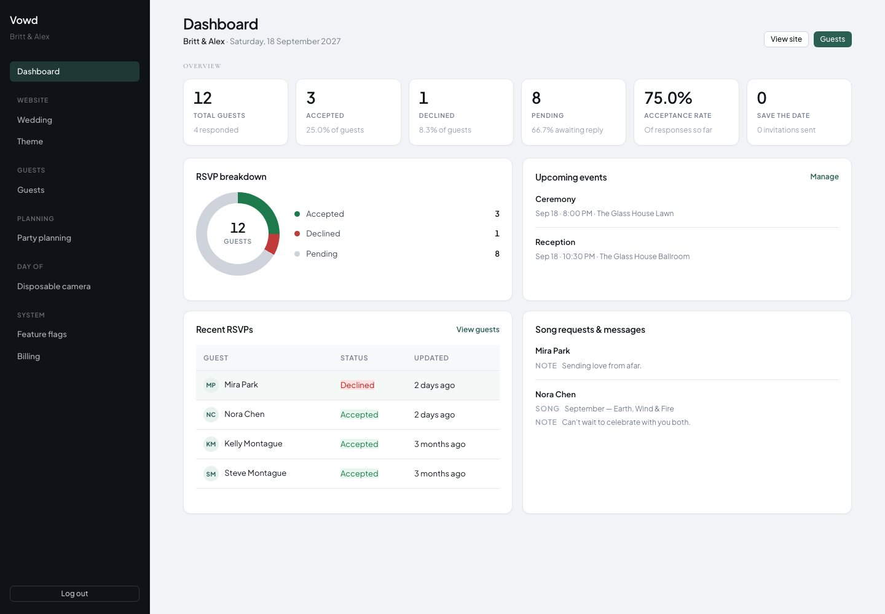

# Vowd

**A wedding website that feels like you.**

Guest pages, RSVPs, save-the-dates, and a disposable camera — on your own subdomain, managed from a private admin.

<p align="center">
  
</p>

<p align="center"><em>Real guest site generated by Vowd (not stock mockups).</em></p>

Sign up, pick a slug, and configure everything from admin.

## Product screenshots

<table>
  <tr>
    <td width="50%">
      
      <h3>RSVP &amp; guest list</h3>
      <p>Invite codes, meal choices, households, and live response tracking.</p>
    </td>
    <td width="50%">
      
      <h3>Save the date</h3>
      <p>Collect early interest, calendar downloads, and a focused pre-RSVP mode.</p>
    </td>
  </tr>
  <tr>
    <td width="50%">
      
      <h3>Disposable camera</h3>
      <p>Guests snap candid shots; you get a live gallery with film-style treatments.</p>
    </td>
    <td width="50%">
      
      <h3>Private admin</h3>
      <p>Edit your site, manage guests and invitations, toggle features — on your wedding host only.</p>
    </td>
  </tr>
</table>

Also included:

- **Email invitations** with tracking
- **Reminder pipeline** (email) with idempotent delivery
- **Custom domains** (CNAME to your wedding subdomain)
- **CSV export** of guest / RSVP data

## Multi-tenant hosts

| Host | Purpose |
|------|---------|
| Apex (`APP_BASE_DOMAIN`) | Marketing landing, signup, login |
| `{slug}.{APP_BASE_DOMAIN}` | That couple’s public site + `/admin` |
| Custom domain | Same wedding site as the subdomain |

One account owns exactly one wedding. Site content lives in the database and is edited under **Admin → Website**.

## Stack

- **Rails 7.1** + Hotwire (Turbo / Stimulus) + Importmap
- **SQLite** with JSON columns for flexible wedding content
- **Tailwind CSS v4** (`@theme` tokens in `app/assets/tailwind/application.css`)
- **Propshaft**, Action Mailer (SMTP), Active Job
- **AWS SDK S3** for disposable-camera object storage (R2 in production)
- **Bcrypt** admin auth (`has_secure_password`)

## Quick Start

### Prerequisites

- Ruby 3.2.0
- SMTP credentials (optional, for sending invitations)

### Setup

```bash
./bin/setup
```

Creates `.env` from `.env.example`, migrates the database, and builds CSS.

### Start

```bash
./bin/dev
```

Rails on port **3003** plus Tailwind watch.

### Local access

In `.env`:

```bash
APP_BASE_DOMAIN=vowd.localhost
APP_PORT=3003
```

Then:

- **Platform**: http://vowd.localhost:3003
- **Wedding site**: http://`{slug}`.vowd.localhost:3003
- **Admin**: http://`{slug}`.vowd.localhost:3003/admin

`*.localhost` resolves to your machine in modern browsers — no `/etc/hosts` needed. Create an account via **Sign up** on the platform apex.

## Project Structure

```
app/
├── assets/images/marketing/   # Product screenshots (landing + README)
├── constraints/               # Platform vs wedding host routing
├── controllers/
│   ├── platform/              # Marketing, signup, login (apex host)
│   ├── public/                # Guest-facing wedding site
│   ├── admin/                 # Wedding admin (ownership-scoped)
│   ├── dispo/                 # Disposable camera + gallery
│   └── concerns/              # WeddingConcern, auth, feature flags
├── models/                    # Wedding (AR), AdminUser, guests, …
├── services/                  # TenantResolver, AppHost, registrations, …
├── views/
│   ├── platform/              # Landing + auth
│   ├── public/                # Wedding pages
│   ├── admin/                 # Dashboard, Website editor, Settings
│   └── layouts/
├── mailers/
└── jobs/
```

## Key Concepts

### Weddings

Each wedding is an ActiveRecord row. The string primary key is the **slug** (subdomain). Content (story, hero, FAQ, etc.) is stored in columns / JSON and edited in admin.

### Tenancy

`TenantResolver` + `AppHost` resolve `current_wedding` from the request host. Never hardcode a product domain — use `APP_BASE_DOMAIN`.

### Households & invite codes

Guests are grouped into households. Each guest gets a unique invite code for RSVP — no guest accounts.

### RSVP workflow

1. Admin creates households and guests
2. Admin sends invitations
3. Guests open their invite link
4. Household RSVPs together
5. Dashboard tracks responses, songs, and messages

## Development

### Styling

Tailwind v4 via `./bin/dev`. Prefer theme tokens and shared classes (`.btn`, `.card`, `.form-control`, admin shell classes) over one-off hex values.

### Tests

```bash
bin/rails test
```

Integration tests set the wedding host via `host_wedding!(wedding)` (see `test/test_helper.rb`).

### Reminder cron

Reminders are per-wedding (`notifications` JSON under Admin → Website).

```bash
bundle exec rails notifications:process_reminders
```

Example cron (every 15 minutes; deliveries are idempotent):

```bash
*/15 * * * * cd /path/to/vowd && /usr/bin/env RAILS_ENV=production bundle exec rails notifications:process_reminders
```

See `config/cron.example`.

### Disposable camera storage

- **Local disk** in development/test → `public/uploads/disposable_camera/`
- **S3-compatible (R2)** in production

Override with `DISPOSABLE_CAMERA_STORAGE=local|s3`. With `BUCKET_NAME` and AWS keys set, development uses the bucket automatically; tests stay on local disk. Bucket env vars: `BUCKET_NAME`, `AWS_ACCESS_KEY_ID`, `AWS_SECRET_ACCESS_KEY`, `AWS_REGION=auto`, `AWS_ENDPOINT_URL_S3` (or `R2_ACCOUNT_ID`).

## Contributing

Open-source and self-hostable. Prefer plain Rails patterns, Stimulus over inline JS, and wedding-scoped data access.

## License

MIT — use for your own wedding or fork as you like.

## Support

Open a GitHub issue for questions or bugs.
